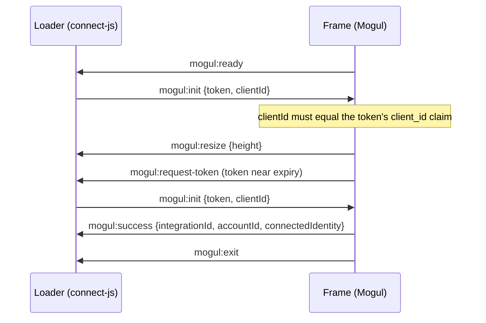

# `@usemogul/connect-js`

The loader for the Mogul Connect component, a framework-agnostic browser library
that a partner drops onto their page. Mounts an iframe pointing at the Mogul embed
host and runs the parent side of a `postMessage` handshake — handing the frame a
session token on request, auto-resizing to the frame's content, and surfacing
`onSuccess` / `onExit` / `onError` callbacks.

The connect flow that renders inside the iframe is hosted by Mogul; this package
is only the parent-side loader. Shared types live in `@usemogul/connect-common`.

## Install

```sh
npm install @usemogul/connect-js
```

## Usage

```ts
import { MogulConnect } from '@usemogul/connect-js'

const handle = MogulConnect.create({
  origin: 'https://embed.usemogul.com', // the Mogul embed host
  container: document.getElementById('mogul-connect')!,
  getToken: async () => fetchSessionTokenFromYourBackend(), // always-fresh
  clientId: 'mcci_…', // your partner client ID (public — never the secret)
  target: 'DISTROKID', // optional: preselect a source; omit to display a search
  onSuccess: ({ integrationId, accountId, connectedIdentity }) =>
    console.log('connected', integrationId, accountId, connectedIdentity),
  onExit: () => handle.destroy(),
  onError: err => console.error(err),
})

// later:
handle.destroy()
```

Also available as a UMD/global build (`window.MogulConnect.create(...)`) via a
`<script>` tag from `dist/index.umd.cjs`.

### Options

| option      | type                                    | notes                                                                                                                             |
| ----------- | --------------------------------------- | --------------------------------------------------------------------------------------------------------------------------------- |
| `origin`    | `string`                                | Embed host origin. Required.                                                                                                      |
| `container` | `HTMLElement`                           | Where the iframe mounts. Required.                                                                                                |
| `getToken`  | `() => Promise<string>`                 | Returns a session token. Called on ready **and** every refresh.                                                                   |
| `clientId`  | `string`                                | Your partner client ID (`mcci_…`). Required. Not a secret.                                                                        |
| `target`    | `string`                                | Preselected `IntegrationTarget` (path segment, not a secret).                                                                     |
| `locale`    | `string`                                | Forwarded in `mogul:init`.                                                                                                        |
| `onReady`   | `() => void`                            | Frame mounted.                                                                                                                    |
| `onResize`  | `(height: number) => void`              | Defaults to setting `iframe.style.height`.                                                                                        |
| `onSuccess` | `(result: MogulConnectSuccess) => void` | A source connected and the user clicked Done.                                                                                     |
| `onExit`    | `() => void`                            | Flow closed (cancelled or finished). Always last.                                                                                 |
| `onError`   | `(err: { code: string }) => void`       | Frame or token error: `token_error`, `invalid_target`, `client_mismatch` or `identity_unavailable` ([error codes](#error-codes)). |

`handle` exposes `iframe`, `logout()`, and `destroy()`.

`onSuccess` receives a `MogulConnectSuccess` (all fields present):

- `integrationId: number` — the created integration; use it for later Mogul API
  calls (e.g. royalty reports for the connected source).
- `accountId: string` — the Mogul account the integration belongs to.
- `connectedIdentity: { id: string; name: string; accounts: { id: string; name: string }[] }`
  — identity parsed from the integration; `accounts` has one entry per synced
  account.

`onSuccess` only fires once the frame reports a complete result; a malformed
`mogul:success` is ignored.

### Error codes

`onError` receives `{ code }`. The codes are exported from
`@usemogul/connect-common` as `CONNECT_ERROR_CODE`. New codes may be added, so
treat unknown ones as a generic failure.

| code                   | emitted by | meaning                                                                                                             |
| ---------------------- | ---------- | ------------------------------------------------------------------------------------------------------------------- |
| `token_error`          | loader     | Your `getToken()` threw.                                                                                            |
| `invalid_target`       | frame      | `target` isn't a known source.                                                                                      |
| `client_mismatch`      | frame      | `clientId` doesn't match the session token's `client_id` claim, so the token is refused and the flow never loads.   |
| `identity_unavailable` | frame      | The source connected, but the integration or a complete identity couldn't be resolved, so `onSuccess` doesn't fire. |

### Frame behavior



- **`clientId` is enforced.** The frame decodes the session token and compares
  its `client_id` claim with `clientId`. A mismatch, or a token with no claim, is
  refused with `client_mismatch`; the flow never loads.
- **Success is all-or-nothing.** `onSuccess` fires only when `integrationId`,
  `accountId`, `connectedIdentity.id`, `connectedIdentity.name` and a name for
  every account are all present. Otherwise `onError` gets `identity_unavailable`.
- **`accounts` lists synced accounts only.** For a multi-account login, these
  are the accounts the user chose in the picker. A single-account source has
  exactly one entry.
- **Success fires on Done.** It's sent when the user dismisses the success
  screen, not the moment the connection job finishes.
- **Exit comes last.** `onExit` always follows the `onSuccess` or `onError` for
  the same completion, so it's safe to call `handle.destroy()` there (as in the
  usage example).
- **`logout()` is a no-op.** The frame accepts `mogul:logout` and ignores it.

### Security

- The token travels **only** via `postMessage` — never in the iframe URL, a
  cookie, or `localStorage`. `getToken` is called on demand.
- `clientId` is public and is sent with every token in `mogul:init`, so Mogul
  can verify which partner is embedding the component. Never put your client
  secret in browser code.
- Outbound messages always target the exact embed origin, never `'*'`.
- Inbound messages are accepted only from the loader's own iframe and the exact
  embed origin, then shape-validated, before anything is acted on.
